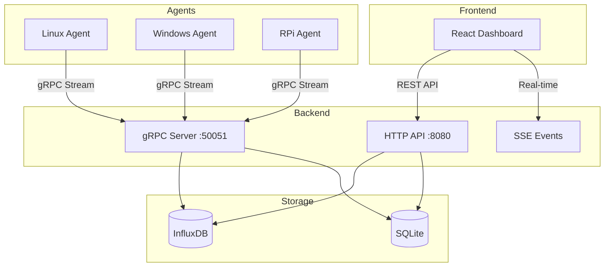

# Sentinel - Distributed System Monitoring and Management

<div align="center">


**Real-time system monitoring, remote management, and Docker container control.**

*Senior Design Project - Software Engineering*

</div>

---

## 📋 Table of Contents

- [Features](#-features)
- [Tech Stack](#-tech-stack)
- [Installation](#-installation)
- [Usage](#-usage)
- [API Reference](#-api-reference)
- [Project Structure](#-project-structure)
- [Architecture](#-architecture)
- [Security](#-security)
- [Development](#-development)

---

## 🚀 Features

### System Monitoring
| Feature | Description |
|---------|-------------|
| **CPU Monitoring** | Real-time CPU usage, per-core analysis |
| **RAM Monitoring** | Memory usage, swap status |
| **Disk I/O** | Read/write speeds, disk capacity |
| **Network Traffic** | Inbound/outbound bandwidth monitoring |
| **Temperature** | CPU thermal sensor data |
| **System Info** | Hostname, OS, uptime, IP addresses |

### Remote Management
- 🔄 **System Reboot/Shutdown**
- ⚡ **Process Management** (list, kill)
- 🐳 **Docker Container Control** (start/stop/restart)
- 🔧 **Systemd Service Management** (Linux)
- 📦 **Agent Update** (remote one-click update)

### Alerting System
- 📊 Threshold-based alerts (CPU, RAM, Disk, Temperature)
- 📱 Ntfy.sh integration (mobile notifications)
- 📜 Audit logs

---

## 🛠 Tech Stack

### Backend (Go)
| Component | Technology | Description |
|-----------|------------|-------------|
| HTTP API | Gin | RESTful API framework |
| RPC | gRPC + Protobuf | Agent-Server communication |
| Metrics DB | InfluxDB | Time-series database |
| Metadata DB | SQLite | Users, agents, settings |
| Auth | JWT + bcrypt | Token-based authentication |
| Rate Limit | Custom middleware | Brute-force protection |

### Frontend (React)
| Component | Technology |
|-----------|------------|
| Framework | React 19 + Vite 7 |
| Styling | TailwindCSS 4 |
| Charts | Recharts |
| Dashboard | Single Page Application (SPA) |
| State | React Context API |

### Agent
| Platform | Technology |
|----------|------------|
| Linux/Windows | Go + gopsutil |
| Docker SDK | Docker API client |
| Systemd | D-Bus interface |

### DevOps
| Component | Technology |
|-----------|------------|
| Containerization | Docker + Docker Compose |
| Multi-stage builds | Alpine Linux |
| Reverse Proxy | Nginx |

---

## 📦 Installation

### Prerequisites
- Docker & Docker Compose
- Go 1.25+ (for development)
- Node.js 20+ (for development)

### 1. Quick Start (Docker)

```bash
# Clone the repository
git clone https://github.com/yourusername/sentinel.git
cd sentinel

# Configure environment variables
cp .env.example .env
# Edit .env file if needed

# Start Development environment
./scripts/dev.sh
# or
./compile_and_run.sh --dev

# Get initial admin password
docker logs sentinel_core | grep -A3 "INITIAL ADMIN"
```

### 2. Production Setup

```bash
# Create production environment file
cp .env.production.example .env
# Update values in .env (IMPORTANT!)

# Start Production
./scripts/prod.sh
# or
./compile_and_run.sh --prod
```

### 3. Agent Installation

#### Linux (Production - Port 80)
```bash
curl -sL http://<SERVER_IP>/downloads/install.sh | sudo bash -s <SERVER_IP>
```

#### Linux (Development - Port 3000)
```bash
curl -sL http://<SERVER_IP>:3000/downloads/install.sh | sudo bash -s <SERVER_IP> 3000
```

#### Windows (PowerShell - Admin)
```powershell
Invoke-WebRequest -Uri "http://<SERVER_IP>/downloads/install.ps1" -OutFile "install.ps1"
.\install.ps1 -ServerIP <SERVER_IP>
```

> **Tip:** You can copy the correct command by clicking the "Add Agent" button on the Dashboard.

---

## 🖥 Usage

### Dashboard
1. Open in browser:
   - **Production:** `http://localhost` (port 80)
   - **Development:** `http://localhost:3000`
2. Login with Admin credentials.
3. View connected agents on the dashboard.

### Dashboard Features
- ➕ **Add Agent:** Add new agents via install command
- ⭐ **Favorite Agents:** Pin important agents to the top
- 🗑️ **Delete Agent:** Quickly remove offline agents
- 🌡️ **CPU Temp:** Real-time thermal indicator

### Agent Detail Page
- Real-time metric charts
- **Avg/Min/Max statistics** (based on time range)
- Process list and management
- Docker container control
- Service management (Linux)

### Settings
- Notification preferences
- Threshold configuration
- Ntfy.sh integration
- Change password

---

## 📡 API Reference

### Authentication
| Method | Endpoint | Description |
|--------|----------|-------------|
| POST | `/api/auth/login` | Login |
| POST | `/api/auth/change-password` | Change password |

### Agent Management
| Method | Endpoint | Description |
|--------|----------|-------------|
| GET | `/api/agents` | List all agents |
| GET | `/api/agent/:id/history` | Metric history |
| GET | `/api/agent/:id/stats?range=1h` | Avg/Min/Max stats |
| POST | `/api/agent/:id/action` | Send system command |
| DELETE | `/api/agent/:id` | Remove agent |

### Docker
| Method | Endpoint | Description |
|--------|----------|-------------|
| GET | `/api/agent/:id/containers` | List containers |
| POST | `/api/agent/:id/docker` | Container action |

### Services
| Method | Endpoint | Description |
|--------|----------|-------------|
| GET | `/api/agent/:id/services` | List services |
| POST | `/api/agent/:id/service/action` | Service action |

### Settings
| Method | Endpoint | Description |
|--------|----------|-------------|
| GET | `/api/settings` | Get settings |
| POST | `/api/settings` | Save settings |

### SSE (Real-time)
| Method | Endpoint | Description |
|--------|----------|-------------|
| GET | `/api/events` | Live event stream |

---

## 📁 Project Structure

```
sentinel/
├── cmd/
│   ├── core/              # Main server entry point
│   │   └── main.go
│   └── agent/             # Agent entry point
│       └── main.go
├── internal/
│   ├── server/            # HTTP & gRPC handlers
│   │   ├── http.go
│   │   └── grpc.go
│   ├── middleware/        # Auth & rate limiting
│   │   ├── auth.go
│   │   └── ratelimit.go
│   ├── store/             # Database operations
│   │   ├── db.go          # SQLite
│   │   └── influx.go      # InfluxDB
│   ├── config/            # Configuration management
│   ├── collector/         # Metric collection
│   └── alert/             # Alerting system
├── web/                   # React frontend
│   └── src/
│       ├── components/    # UI components
│       ├── context/       # React context
│       └── utils/         # Helper functions
├── website/               # Landing Page & Documentation (Next.js)
├── proto/                 # Protobuf definitions
├── deploy/
│   ├── Dockerfile.core
│   ├── Dockerfile.web
│   └── downloads/         # Agent install scripts
├── scripts/
│   ├── dev.sh
│   └── prod.sh
├── docker-compose.yml
├── docker-compose.dev.yml
└── docker-compose.prod.yml
```

---

## 🏗 Architecture



---

## 🔒 Security

| Feature | Implementation |
|---------|----------------|
| Authentication | JWT (24-hour validity) |
| Password Hashing | bcrypt |
| Rate Limiting | Login: 5/min, API: 100/min |
| CORS | Configurable origins |

---

## 🔧 Development

### Local Development
```bash
# Backend
go run cmd/core/main.go

# Frontend
cd web && npm install && npm run dev

# Website (Landing & Docs)
cd website && npm install && npm run dev

# Agent test
go run cmd/agent/main.go --server=localhost:50051
```

### Proto Compilation
```bash
protoc --go_out=. --go_opt=paths=source_relative \
    --go-grpc_out=. --go-grpc_opt=paths=source_relative \
    proto/service.proto
```

---

## 📄 License

MIT License

---

## 🤝 Contribution

This project was developed as a Senior Design Project for Software Engineering.

---

<div align="center">
<b>Sentinel</b> - Monitor and manage distributed systems from a single point.
</div>
